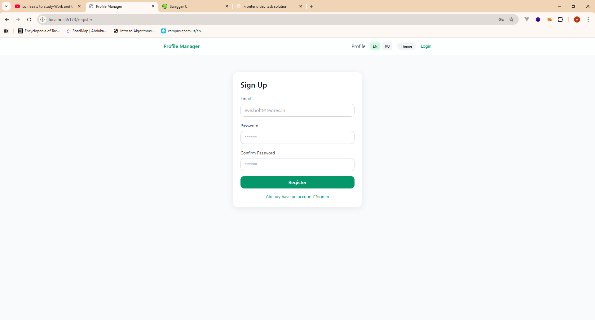
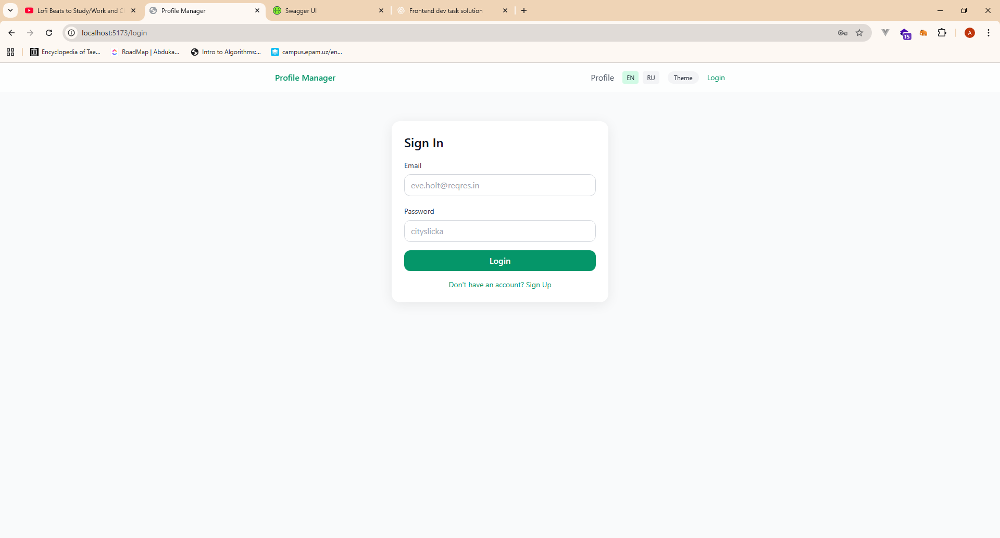

# Profile Manager App

A small React + TypeScript app that demonstrates registration, login, protected routes, and a profile page backed by the public ReqRes API.

## Tech Stack
- React 18, TypeScript
- Vite
- Tailwind CSS
- React Router v6
- Axios
- React Hook Form
- react-i18next (EN/RU)
- Framer Motion (subtle animations)

## Features (meets assignment)
- /register with validation and loading states
- /login with error handling
- /profile protected route showing avatar, name, email
- Private routes with redirect to /login if unauthenticated
- Auth state persisted in localStorage
- Language switcher EN/RU stored in localStorage
- Dark/Light theme toggle
- Toast notifications & loader
- Mobile-first, responsive UI

### API
- Base: https://reqres.in/api
- Register: POST /register
- Login: POST /login
- Profile: GET /users/{id} (uses id=2 by default after login)

### Test Credentials
```
Email: eve.holt@reqres.in
Password: cityslicka
```

## Getting Started

```bash
npm install
npm run dev
```

### Build
```bash
npm run build
npm run preview
```

## Deployment
- Vercel / Netlify (recommended for SPA). No special config needed.

## Project Structure
```
src/
  components/
    common/
    forms/
    layout/
  hooks/
  locales/
  pages/
  routes/
  services/
  styles/
  utils/
```

## AI Usage Disclosure

- **Tools Used**: ChatGPT (GPT-5 Thinking)
- **Purpose**: Code generation, documentation writing, refactoring suggestions
- **Specific Tasks**:
  - Generated initial project scaffolding, React components, routing, i18n setup, and Tailwind config.
  - Helped structure forms with React Hook Form and create protected routes.
  - Wrote README and basic UI/UX elements (toasts, loader).
- **Percentage of AI-written code**: ~85%

## Screenshots






---

**Note**: This app uses a demo flow. After successful login, it stores the token and sets `userId=2` to fetch a sample user from ReqRes for the profile page.
